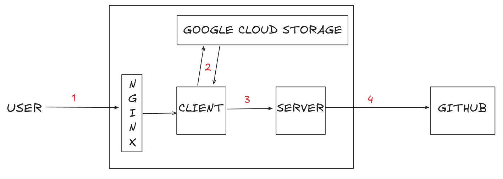
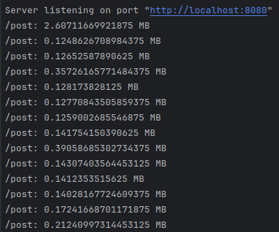

# How to scale this blog?

I love to open up posts with a question.

Here's how this blog is architected today:



1 - You came here by (at the time I'm writing this) "https://denis.my". This hits my GCP infrastructure at a nginx that I run inside a cloud run instance. Each cloud run has its own nginx, which I use only to map the URLs to the HTMLs that I store.

2 - Those HTMLs have pull up objects from Google Cloud Storage, which execute scripts to call the server.

3 - The server is really a wrapper to an API call to GitHub, where I store the .md post files.

4 - I get the post from GitHub, ignoring absolutely ANY ERRORS that may occur in the way.

That's it. No fancy stuff, no security at all, no gateway, everything is public and accessible by everyone in the internet. I didn't even get metrics and logs up because it's such a small application that I don't think it's worth to bother.

All I needed is to ship the blog, and that's what I did. I don't want/need to scale right now either, but I want to at least have a plan.

---

## How much can we take right now?

Let's start by the server. My cloud run have a cap of 10 instances to be scaled up, and each one has a default of 80 concurrent connections. I serve very light content, so, unless I need to deal with more than 800 concurrent requests, I'm not very concerned about scalability by now.

But let's try to see how can I clog my blog. Let's start with the server because it's easier for me.

I'll assume a lot of things and even slightly miss some calculations, so this will be very theoretical, the server would probably freeze before I'm predicting.

Let's imagine that the blog is popular and every day, at the same freaking time, 800 people access the same freaking post. [My first blog](https://github.com/denis-rossati/blog-posts/blob/main/what%20is%20up%20with%20overengineering%3F.md) is 15KB (might have changed if I edited it), but GitHub serves the content in base64, which is slightly larger, so my server answers with around 20.7KB of information, not considering other small and irrelevant fields such as title, so let's keep it at 20KB for simplicity.

While executing a request, most of the time is spent idle, waiting on GitHub's response, allowing it to handle the other requests. This is a sign that my application is mainly IO-bound.

About the server setup, I'm using Node with Express and JOI, so I think each request has around 5-10Mib?

Let's try to measure with this silly middleware, which is already interfering with my numbers, but it will be enough for now.

```ts
app.use((req, res, next) => {
    const before = process.memoryUsage().heapUsed;

    res.on('finish', () => {
        const after = process.memoryUsage().heapUsed;
        console.log(`${req.path}: ${(after - before) / 1024 / 1024} MB`);
    });

    next();
});
```

It measures the heap memory usage when responding the request. The 1024 divisions are to convert the heap usage to MB since the numbers are represented in bytes. This should get the job done at a small scale, I'll ignore stuff I don't understand right now, like the amount of optimizations that might be at JIT interpretation level.



I imagine that the first request has a bunch of allocations, the others are just reusing it. So I'll use all but the first for a general measure. 180KB it is.

```
180KB * 800 concurrent requests = 144000KB

144000KB / 1024 = 140MB
```

I think this will not hit my 512MB cap, but let's calculate the data that each request would carry anyway...

```
20KB * 800 requests = 16000KB

16000KB / 1024 = 15.625MB
```

Huh, only 15MB in RAM? That's not a lot,

That was not even close... You shoulda seen my face when I assumed that each request took 10Mib without measuring it XD

Okay, the server can handle the maximum amount of concurrent requests just fine. But what if I need scale? Like 10k concurrent users?

I think I might face GitHub's rate limit at this point. Let's tackle this issue first.

(Write about sending GitHub data to cloud storage here. Each commit updates the cloud storage and then you serve the content at the Cloud Storage CDN)

---


Considerations:

- C10k problem https://en.wikipedia.org/wiki/C10k_problem

